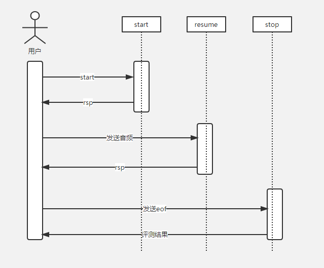

# 云知声 Websocket API文档

* [时序图](#sequence)
* [请求地址](#url)
* [英文API](#EnAPI)
* [中文API](#CnAPI)
* [响应接口](#response)
* [拼接评测audio url](#audio)
* [java示例代码](#javademo)
* [小程序示例代码](#wxdemo)
* [错误码列表](#errorcode)


### <a name="sequence"></a>时序图
* 

### <a name="URL"></a>请求地址

#### 英文
```
主域名：ws-edu.hivoice.cn
端口：8081
请求地址：ws://ws-edu.hivoice.cn:8081/ws/eval/或wss://wss-edu.hivoice.cn:443/ws/eval/
```

#### 中文
```
主域名：wscn-edu.hivoice.cn
端口：18081
请求地址：ws://wscn-edu.hivoice.cn:18081/ws/eval/
```

### <a name="EnAPI"></a>英文API

#### 1.普通评测
``` json
{
  "mode": "word",
  "displayText": "hello world",
  "appkey": "联系商务同学获取",
  "scoreCoefficient": "1",
  "userID": "",
  "audioFormat": "opus",
  "eof": "gnh-test-end"
}
```
#### 2.jsgf接口
```
{
  "mode": "qa",
  "Version": "1",
  "DisplayText": "Jsgf Grammar Tool Generated",
  "GrammarWeight": "{\"weight_struct\":[[{\"weight\":0.5,\"key\":\"good morning\"}]]}",
  "Grammar": "#JSGF V1.0 utf-8 cn;\ngrammar main;\npublic <main> = \"<s>\"(<a>|<a> to you)\"</s>\";\n<a> = (good morning);\n",
  "Appkey": "",
  "scoreCoefficient": "1",
  "UserID": "",
  "eof": "test-end",
  "audioFormat": "pcm"
}
```
#### 3.枚举接口
``` json
{
  "mode": "qa",
  "version": "1",
  "displayText": "Enumerate Grammar Tool Generated",
  "grammarWeight": "{\"weight_struct\":[[{\"weight\":0.5,\"key\":\"teacher\"}]]}",
  "grammar": "#enumerate \nmy mother is a teacher\na teacher\n",
  "appkey": "",
  "scoreCoefficient": "1",
  "userID": "",
  "eof": "test-end",
  "audioFormat": "pcm"
}
```
#### 4.retell接口
``` json
{
  "mode": "retell",
  "Version": 1,
  "EvalType": "en.exam.retell",
  "DisplayText": "OralComposition Grammar Tool Generated",
  "Language": "en",
  "Grammar": "",
  "GrammarWeight": "{\"weight_struct\":[[{\"weight\":0.5,\"key\":\"bookstore\"}]]}",
  "Reference": {
    "ID": "",
    "answers": [
      {
        "type": 1,
        "text": "bookstore"
      },
      {
        "type": 1,
        "text": "she is going to bookstore"
      }
    ]
  },
  "Appkey": "",
  "scoreCoefficient": "1",
  "UserID": "",
  "eof": "test-end"
}

```

#### 英文评测请求接口字段说明(关键字不区别大小写)

|  |  |  |  |
| ----- | ----- | ----- | ----- |
| 字段 | 是否必选 | 含义 | 备注 |
| mode | 必填 | 可选值为word,sent,para,qa,retell | ----- |
| displayText | 必填 | 评测文本 | ----- |
| appkey | 必填 | 秘钥信息 | ----- |
| userID | 可选 | 用户id信息 | 建议传入，排查问题方便 |
| audioFormat | 必填 | 可选值：mp3,speex | 音频格式，音频16K单声道 |
| eof | 必填 | 设置eof消息包内容 | 客户端需要保证该内容的唯一性，可选用uuid |
| scoreCoefficient | 可选 | 值范围：0.6-1.9 | 打分系数，调整打分的松紧度，值越大打分越宽松 |


### <a name="CnAPI"></a>中文API

#### 1.中文评测
``` json
{
  "EvalType": "sentence",
  "Language":"cn",
  "displayText": "你好",
  "appkey": "联系商务同学获取",
  "scoreCoefficient": "1",
  "userID": "",
  "audioFormat": "mp3",
  "eof": "gnh-test-end"
}
```


#### 中文评测请求接口字段说明(关键字不区别大小写)

|  |  |  |  |
| ----- | ----- | ----- | ----- |
| 字段 | 是否必选 | 含义 | 备注 |
| EvalType | 必填 | 可选值为word,sentence,paragraph | ----- |
| Language | 必填 | 语种，可选值为cn |  |
| displayText | 必填 | 评测文本 | ----- |
| appkey | 必填 | 秘钥信息 | ----- |
| userID | 可选 | 用户id信息 | 建议传入，排查问题方便 |
| audioFormat | 必填 | 可选值：mp3,speex | 音频格式，音频16K单声道 |
| eof | 必填 | 设置eof消息包内容 | 客户端需要保证该内容的唯一性，可选用uuid |
| scoreCoefficient | 可选 | 值范围：0.6-1.9 | 打分系数，调整打分的松紧度，值越大打分越宽松 |


### <a name="response"></a>响应接口
``` json
{
  "result": {},
  "area": "sh",
  "time": "1551409712576231666",
  "sid": "f4376e83-7ad0-4635-9812-bec949a2fa27",
  "errcode": 0,
  "errmsg": "ok"

}
```
#### 响应接口字段说明

|  |  |  |
| ----- | ----- | ----- |
| 字段 | 含义 | 备注 |
| result | 评测结果 |<a href=https://github.com/oraleval/FAQ-Docs/blob/master/Json%20Description.md>Json字段说明</a> |
| area | 返回实际评测的的机房区域 | |
| time | 时间戳 | |
| sid sessionID | 服务端返回的唯一标识 | |
| errorcode | 错误码 | |
| errmsg | 错误消息 | |

### <a name="audio"></a>拼接评测audio url

> 想要获取用户录音结果，则可以根据响应接口数据拼接音频url，获取音频

```
  "area": "sh",
  "time": "1551409712576231666",
  "sid": "f4376e83-7ad0-4635-9812-bec949a2fa27",
```

> 其中，sh是代表地域名称area，1551409712576231666是代表createtime；f4376e83-7ad0-4635-9812-bec949a2fa27是代表请求中传入的session-id

> 最后可以根据以上三个信息拼接url，固定字段http://edu.hivoice.cn:9088/WebAudio-1.0-SNAPSHOT/audio/play/{session-id}/{createtime}/{area}

> 以上示例，最后拼接的url是http://edu.hivoice.cn:9088/WebAudio-1.0-SNAPSHOT/audio/play/02055555-f4cd-4fef-8ed8-1a2089056acf/1542272221203805792/sh

> **如果是https协议**，拼接按照 https://edu.hivoice.cn/WebAudio-1.0-SNAPSHOT/audio/play/{session-id}/{createtime}/{area}


### <a name="javademo"></a>java示例代码
请访问
https://github.com/unisound-oraleval/websocket-javademo

### <a name="wxdemo"></a>小程序示例代码
#### 小程序调用示例：
**index.js**
```
// miniprogram/pages/test/index.js

// 调用过程
// 1.建立websocket 连接
// 2.在连接建立成功后，发送第一个头信息包
// 3.发送音频buf
// 4.发送end 包
// 5.关闭连接

const appkey = "申请的appkey"
Page({

  data: {
    result: "",
    isRecording: false
  },

  onLoad: function(options) {
    this.init()
  },
  record() {
    if (!this.data.isRecording) {
      this.setData({
        result: "",
      })
      this.openSocket()
    }
  },
  stop() {
    this.setData({
      isRecording: false
    })
    this.rmg.stop()
  },
  openSocket(cb) {
    this._sid = 'uuid-t' + Date.now()
    //  建立websocket 连接
    this.socket = wx.connectSocket({
      url: 'wss://wss-edu.hivoice.cn:443/ws/eval/',
      success(res) {
        console.log('ok', res)
      },
      fail(err) {
        console.log("fail", err)
      }
    })
    // 监听websocket 连接是否打开
    this.socket.onOpen(res => {
      console.log("open", res)
      // 启动录音 （使用16K单声道mp3）
      this.rmg.start({
        duration: 600000,
        sampleRate: 16000,
        numberOfChannels: 1,
        format: "mp3",
        frameSize: 2
      })
      // 发送第一个消息包，
      this.socket.send({
        data: JSON.stringify({
          appkey: appkey,
          "displayText": "hello, nice too meet you!",
          "audioFormat": "mp3",
          "eof": this._sid
        })
      })
    })
    this.socket.onError(err => {
      console.log("error", err)
      this.socket.close()
    })
    this.socket.onMessage(res => {
      // 接收服务器响应消息
      console.log("msg", res)
      // 这里需要判断是否是最后一个包，如果是则close socket
      this.socket.close()
      if (res.data) {
        try {
          const data = JSON.parse(res.data)
          this.setData({
            result: JSON.stringify(data, null, 4)
          })
        } catch (e) {
          console.log("解析result失败")
        }
      }
    })
  },
  init() {
    const rmg = this.rmg = wx.getRecorderManager()
    rmg.onStart(() => {
      this.setData({
        isRecording: true
      })
    })
    rmg.onStop((res) => {})
    rmg.onError(err => {
      this.setData({
        isRecording: false
      })
      this.socket.close()
    })
    rmg.onFrameRecorded(res => {
      // 监听录音接口， 并将录音buf发送到服务器
      this.socket.send({
        data: res.frameBuffer,
        success(res) {
          console.log("send ok", res)
        },
        fail(err) {
          console.log("send err", err)
        }
      })
      if (res.isLastFrame) {
        // 录音结束，发送 end 消息包
        this.socket.send({
          data: this._sid,
          complete: () => {
            console.log("send end EOF")
          }
        })
      }
    })
  }
})
```
**index.wxml**
```
<!--miniprogram/pages/test/index.wxml-->
<view class='text'>hello, nice too meet you!</view>
<button hidden='{{isRecording}}' bindtap='record'>start</button>
<button hidden='{{!isRecording}}' bindtap='stop'>stop</button>
<view>
<view></view>
<text>{{result}}</text>
</view>
```


### <a name="errorcode"></a> websocket接口错误码

>| 错误码（十进制） | 错误码（十六进制） | 错误码描述 | 原因 | 处理建议 |
>| :--- | :--- | :--- | :--- | :--- |
>| 57345 | 0x0000E001 | 连接引擎服务失败 | 服务连接数过大 | 建议提示网络出错 |
>| 57351 | 0x0000E007 | 传给引擎服务的用户文本过长 | 输入文本长度过大，最支持10000字符 | 减少文本长度 |
>| 57352 | 0x0000E008 | 半开放题型语法错误 | 半开放题型json语法错误 | 检查输入的半开放题型文本 |
>| 8193 | 0x00002001 | 连接n2t服务出错 | 服务偶尔连接失败 | 建议提示网络出错 |
>| 8195 | 0x00002003 | n2t解析错误 | 一般半开放题型可能会出现格式不正确解析失败 | 检查半开放题型语法 | 
>| 8198 | 0x00002006 | n2t组装结果出错,E模式会组装结果 | 服务组装出错 | 建议提示网络出错 |
>| 61440 | 0x0000F000 | 服务出错 | 后端服务内部未知错误 |  |  |
>| 61442| 0x0000F002 | 客户端异常中止 | 录音过程客户端取消评测 |  |
>| 61443| 0x0000F003 | 语音数据传送被中断 | 客户端发送数据超时 | 建议提示网络出错 |
>| 65295 | 0x0000FF0F | 参数错误 | 用户传过来的appkey为空 | 上传appkey |
>| 65527 | 0x0000FFF7 | 参数错误 | 用户传过来的文本是空，或者用户文本全部由特殊字符组成 | 检查文本 |
>| 65532 | 0x0000FFFC | 引擎服务stop返回错误 | 音频过短，少于64Byte;或是音频格式和访问地址不符合 | 检查音频和访问地址 | 
>| 65533 | 0x0000FFFD | 参数错误 | 用户传的appkey错误 |   | 建议联系云知声获取正确的appkey |
>| 49153 | 0x0000C001 | 服务错误 | 连接转码服务出错 | 网络等原因导致连接失败 | 建议提示网络出错 |
>| 49155 | 0x0000C003 | 服务错误 | 转码服务转码过程中出错 | 访问的服务地址和上传的音频格式可能不符 | 建议检查音频和访问地址 |
>| 700417 | 0x000AB001 | websocket请求参数错误 | | 建议检查采参数格式 |
>| 712705 | 0x000AE001 | websocket写音频超时 |  |  |
>| 49152 | 0x0000C000 | 音频格式为空 |  | 检查audioFormat参数 |
>| 978944 | 0x000EF000 | 结束符为空 |  |  |
>| 712704 | 0x000AE000 | 错误的数据包格式 |  |  |


